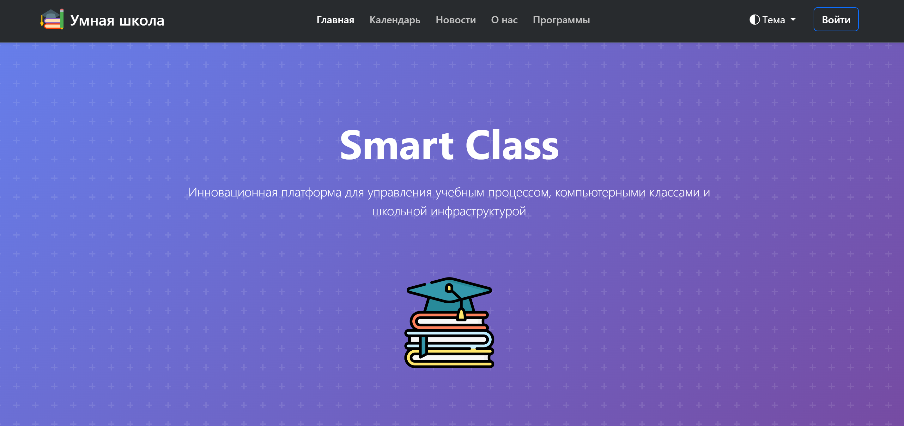

# 💻 SmartClass: Платформа управления умной школой

Добро пожаловать в **SmartClass** — систему для администрирования и мониторинга состояния компьютеров в учебных классах. Платформа предоставляет интерфейс для управления устройствами, создания новостей и отображения информации для пользователей.

---

## 📖 Оглавление
- [Описание проекта](#описание-проекта)
- [Функционал](#функционал)
- [Ссылки](#ссылки)

---

## Описание проекта

**SmartClass** — это веб-приложение, разработанное на Django, предназначенное для:
- Управления компьютерными устройствами в учебных заведениях.
- Мониторинга статуса устройств (заблокирован, включён звук, работает).
- Хранения и отображения новостей, изображений и другой информации.
- Разделения доступа и отображения контента в зависимости от пользователя.
- Управления питанием в столовой.
- Создание и управление календарем событий школы.
- Управления техническими проблемами для быстрого решения.
- Обучения через решения задания банка ФИПИ.
- Обучения через интерактивные игры.

---

## Ссылки

- **Репозиторий проекта:** [GitHub](https://github.com/124476/Smart_Class_web/)
- **Демо-сайт:** [Smart Class](https://demosmartclass.pythonanywhere.com/)
- **Десктопное приложение:** [Smart Class desktop](https://github.com/124476/Smart_Class_desktop/)

> **Примечание:** Инструкцию по запуску проекта и настройке окружения см. в [setup.md](setup.md)

---

🛠 **Совет:** При возникновении проблем создавайте Issue в репозитории.
